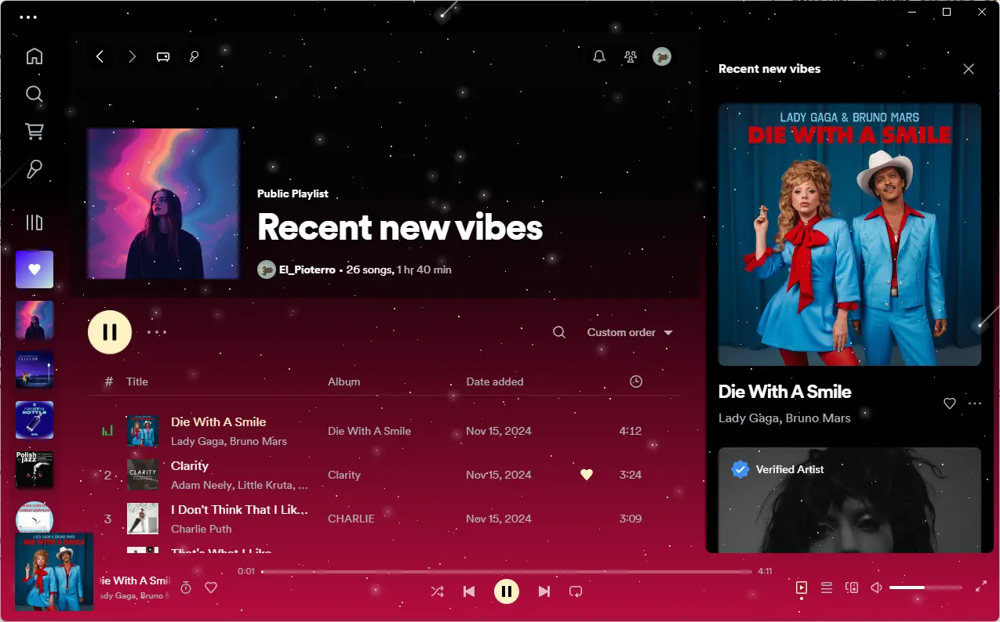
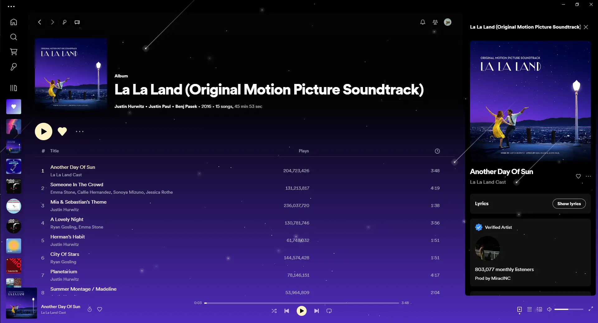
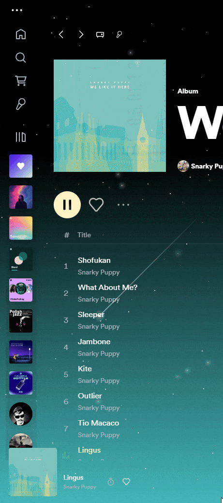
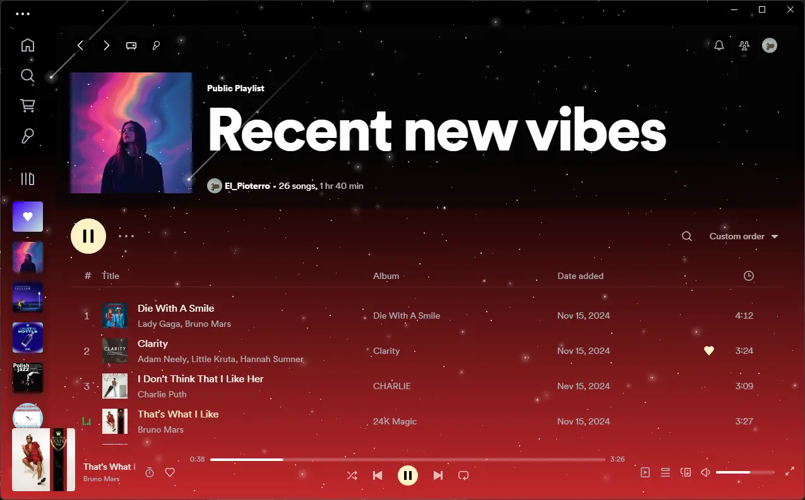

<div align="center">
  <h1>StarryNight Vibrant - Dynamic Gradient</h1>
  Spicetify theme and extension that dynamically changes the background gradient based on the currently playing song's cover art. Includes the classic StarryNight shooting stars effect.

  <hr>

  <!-- Optional: Add if you want this -->

**Consider starring the repository if you like it!**

  <!-- Optional: Add if you have community links -->
  <!-- ## Join the Community! -->
  <!-- - **GitHub Issues:** [Link to your issues page] -->
  <!-- - **Discord:** [Link to your Discord server, if any] -->

</div>

## **Screenshots**

**(IMPORTANT: Replace placeholders below with actual paths to your screenshots!)**

### Dynamic Gradient in Action

<div style="display: flex; flex-wrap: wrap; justify-content: center; gap: 0.5rem">
  
  
  
  
</div>

### Different Modes (Examples)

<!-- Add screenshots showcasing Static, Random Static, Progress-Based modes if visually distinct -->
<div style="display: flex; flex-wrap: wrap; justify-content: center; gap: 0.5rem">
  
  
</div>

### Configuration Settings


## **Features**

- **Dynamic Background:** Extracts colors from the current song's cover art to create a smooth, animated background gradient.
- **Multiple Modes:** Choose how the gradient updates:
  - **Static:** One gradient per song (primary color).
  - **Random Static:** One gradient per song (random palette color).
  * **Progress-Based:** Cycles through palette colors as the song plays.
- **Configurable Animation:** Adjust animation speed and behavior.
- **Settings Menu:** Easily configure modes and timings via the Spicetify settings menu (Profile -> Settings).
- **StarryNight Base:** Includes the beautiful shooting star animation from the original StarryNight theme.
- **Bundled Extension:** The required `Dynamic Gradient` extension is automatically included when you install the theme from Marketplace.

## **Important Note**

This theme relies on specific CSS variables (`--gradient-main`, `--gradient-secondary`) defined in its `user.css`. While it includes the necessary extension, using the dynamic gradient feature with _other_ themes might require manually adding these CSS variables and potentially other adjustments to the target theme's CSS.

## **Installation (from Marketplace)**

1.  Install the theme directly from the Spicetify Marketplace.
2.  Select the theme:
    ```bash
    spicetify config current_theme "StarryNight Vibrant - Dynamic Gradient" color_scheme base
    ```
    _(Replace `base` if you install other color schemes for StarryNight later)._
3.  Apply the changes:
    ```bash
    spicetify apply
    ```

## **Configuration**

After installation, go to Spicetify's settings menu (**Your Profile Picture -> Settings**) to find the **"Gradient Theme Settings"** section and customize the mode, sections (for Progress-Based mode), and animation timings.

## **Dependencies**

- Latest version of [Spicetify](https://github.com/spicetify/spicetify-cli).
- Latest version of [Spotify](https://www.spotify.com/download). Tested on Spotify for Windows `1.2.14.1149` & Spicetify `v2.39.6` (compatibility may vary).

## **Troubleshooting**

### Issues after installing from Spicetify Marketplace

If the theme doesn't apply correctly, try running these commands and then re-apply:

```sh
spicetify config current_theme "StarryNight Vibrant - Dynamic Gradient" color_scheme base # Or your chosen scheme
spicetify config inject_css 1 replace_colors 1 overwrite_assets 1 inject_theme_js 1
spicetify apply
```

### Gradient Animation seems sluggish or missing

- Ensure Enable hardware acceleration is turned ON in Spotify's main settings (Settings -> Scroll down to Compatibility).
- Try restarting Spotify after applying the theme.

## Acknowledgements

- Original Theme Concept: This theme is heavily inspired by and builds upon the StarryNight theme created by b-chen00. (Original Theme).
- Shooting Stars CSS: The shooting star animation effect used in the theme was created by Delroy Prithvi.
  - Source: CodePen
  - License:
    Okay, here is a `README-Marketplace.md` file tailored for your "StarryNight Dynamic Gradient" theme + extension, using the structure and style of the "Lucid" example you provided, but with your project's specific content.

**Important Notes:**

1.  **Screenshots are Crucial:** The Lucid example heavily relies on images. You **must** create screenshots for your theme and place them in your repository (e.g., in an `assets/images/` folder) and update the `src` paths in the markdown below accordingly. I've added placeholders and suggestions.
2.  **File Name:** Save this content as `README-Marketplace.md` in the root of your repository. The Marketplace _might_ specifically look for this filename, although often it just uses the main `README.md`. Having both (`README.md` for general GitHub viewers and `README-Marketplace.md` potentially optimized for the platform) isn't uncommon, but check Marketplace guidelines if unsure. If only one README is preferred by Marketplace, consider renaming your main README or merging the content. For now, let's assume `README-Marketplace.md` is desired.
3.  **Theme Name:** I'm using "StarryNight Dynamic Gradient" as decided for the `manifest.json`. Ensure consistency.

---

````markdown
# README-Marketplace.md

<div align="center">
  <h1>StarryNight Dynamic Gradient</h1>
  Spicetify theme and extension that dynamically changes the background gradient based on the currently playing song's cover art. Includes the classic StarryNight shooting stars effect.

  <hr>

  <!-- Optional: Add if you want this -->
  <!-- **Consider starring the repository if you like it!** -->

  <!-- Optional: Add if you have community links -->
  <!-- ## Join the Community! -->
  <!-- - **GitHub Issues:** [Link to your issues page] -->
  <!-- - **Discord:** [Link to your Discord server, if any] -->

</div>

## **Screenshots**

**(IMPORTANT: Replace placeholders below with actual paths to your screenshots!)**

### Dynamic Gradient in Action

<div style="display: flex; flex-wrap: wrap; justify-content: center; gap: 0.5rem">
  
  
  
  
</div>

### Different Modes (Examples)

<!-- Add screenshots showcasing Static, Random Static, Progress-Based modes if visually distinct -->
<div style="display: flex; flex-wrap: wrap; justify-content: center; gap: 0.5rem">
  
  
</div>

### Configuration Settings


## **Features**

- **Dynamic Background:** Extracts colors from the current song's cover art to create a smooth, animated background gradient.
- **Multiple Modes:** Choose how the gradient updates:
  - **Static:** One gradient per song (primary color).
  - **Random Static:** One gradient per song (random palette color).
  * **Progress-Based:** Cycles through palette colors as the song plays.
- **Configurable Animation:** Adjust animation speed and behavior.
- **Settings Menu:** Easily configure modes and timings via the Spicetify settings menu (Profile -> Settings).
- **StarryNight Base:** Includes the beautiful shooting star animation from the original StarryNight theme.
- **Bundled Extension:** The required `Dynamic Gradient` extension is automatically included when you install the theme from Marketplace.

## **Important Note**

This theme relies on specific CSS variables (`--gradient-main`, `--gradient-secondary`) defined in its `user.css`. While it includes the necessary extension, using the dynamic gradient feature with _other_ themes might require manually adding these CSS variables and potentially other adjustments to the target theme's CSS.

## **Installation (from Marketplace)**

1.  Install the theme directly from the Spicetify Marketplace.
2.  Select the theme:
    ```bash
    spicetify config current_theme "StarryNight Dynamic Gradient" color_scheme base
    ```
    _(Replace `base` if you install other color schemes for StarryNight later)._
3.  Apply the changes:
    ```bash
    spicetify apply
    ```

## **Configuration**

After installation, go to Spicetify's settings menu (**Your Profile Picture -> Settings**) to find the **"Gradient Theme Settings"** section and customize the mode, sections (for Progress-Based mode), and animation timings.

## **Dependencies**

- Latest version of [Spicetify](https://github.com/spicetify/spicetify-cli).
- Latest version of [Spotify](https://www.spotify.com/download). Tested on Spotify for Windows `1.2.14.1149` & Spicetify `v2.39.6` (compatibility may vary).

## **Troubleshooting**

### Issues after installing from Spicetify Marketplace

If the theme doesn't apply correctly, try running these commands and then re-apply:

```sh
spicetify config current_theme "StarryNight Dynamic Gradient" color_scheme base # Or your chosen scheme
spicetify config inject_css 1 replace_colors 1 overwrite_assets 1 inject_theme_js 1
spicetify apply
```
````

### Gradient Animation seems sluggish or missing

- Ensure `Enable hardware acceleration` is turned ON in Spotify's main settings (Settings -> Scroll down to Compatibility).
- Try restarting Spotify after applying the theme.

## **Acknowledgements**

- **Original Theme Concept:** This theme is heavily inspired by and builds upon the **StarryNight** theme created by **[b-chen00](https://github.com/b-chen00)**. ([Original Theme](https://github.com/spicetify/spicetify-themes/tree/master/StarryNight)).
- **Shooting Stars CSS:** The shooting star animation effect used in the theme was created by **Delroy Prithvi**.

  - Source: [CodePen](https://codepen.io/delroyprithvi/pen/LYyJROR)
  - License:

    ```
    Pure CSS Shooting Star Animation Effect Copyright (c) 2021 by Delroy Prithvi (https://codepen.io/delroyprithvi/pen/LYyJROR)

    Permission is hereby granted, free of charge, to any person obtaining a copy of this software and associated documentation files (the "Software"), to deal in the Software without restriction, including without limitation the rights to use, copy, modify, merge, publish, distribute, sublicense, and/or sell copies of the Software, and to permit persons to whom the Software is furnished to do so, subject to the following conditions:

    The above copyright notice and this permission notice shall be included in all copies or substantial portions of the Software.

    THE SOFTWARE IS PROVIDED "AS IS", WITHOUT WARRANTY OF ANY KIND, EXPRESS OR IMPLIED, INCLUDING BUT NOT LIMITED TO THE WARRANTIES OF MERCHANTABILITY, FITNESS FOR A PARTICULAR PURPOSE AND NONINFRINGEMENT. IN NO EVENT SHALL THE AUTHORS OR COPYRIGHT HOLDERS BE LIABLE FOR ANY CLAIM, DAMAGES OR OTHER LIABILITY, WHETHER IN AN ACTION OF CONTRACT, TORT OR OTHERWISE, ARISING FROM, OUT OF OR IN CONNECTION WITH THE SOFTWARE OR THE USE OR OTHER DEALINGS IN THE SOFTWARE.
    ```

## **License**

[LICENSE.md](LICENSE)
